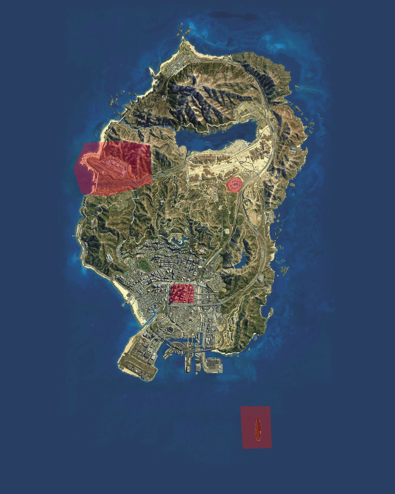

Noorderland kent enkele risicogebieden. In een risicogebied mag preventief gefouilleerd worden. Dus dat wil ook zeggen dat ook voertuigen gecontroleerd mogen worden. Hier onder zijn deze gebieden aangegeven.

## Kaart weergave

